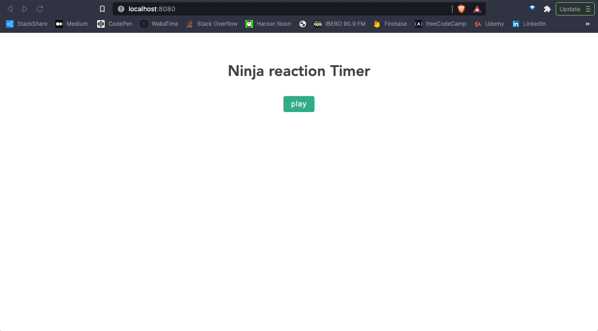

# reaction-timer

Timer App game in Vue.js 💻

 ***
 Exercise from the Udemy Course [build web apps with vuejs firebase](https://www.udemy.com/course/build-web-apps-with-vuejs-firebase/)
 ***

## Running Project setup
```
npm install
```
```
npm run serve
```

```
npm run build
```


